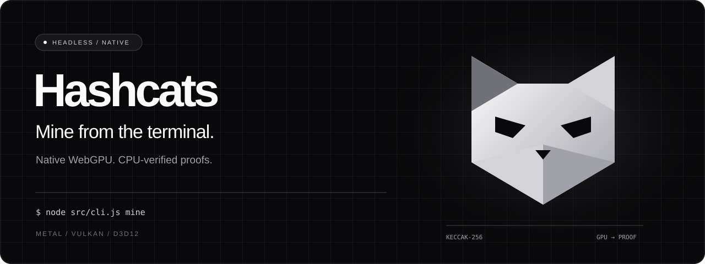

<p align="center">
  
</p>

<p align="center">
  <strong>A standalone GPU miner for <a href="https://hashcats.fun/mine">Hashcats</a> on Robinhood Chain.</strong><br />
  Node.js orchestration. Native GPU compute. No browser or wallet extension required.
</p>

<p align="center">
  <a href="#runpod-one-command-setup">RunPod wizard</a> ·
  <a href="#quick-start">Quick start</a> ·
  <a href="#performance">Performance</a> ·
  <a href="#automatic-minting">Automatic minting</a> ·
  <a href="docs/protocol.md">Protocol notes</a>
</p>

---

## Built to run headless

| Native compute | Verified work | Controlled submission |
| :--- | :--- | :--- |
| Dawn WebGPU runs WGSL directly through Metal, Vulkan, or D3D12. | Every GPU winner is independently hashed on the CPU. | Explicit mint and gas ceilings, simulation, and a transaction journal before broadcast. |

## RunPod: one-command setup

Start an **NVIDIA GPU pod** with an **Ubuntu-based RunPod PyTorch CUDA development image with `nvcc`** (Linux x86_64), then open its root terminal and run:

```sh
curl -fsSL https://raw.githubusercontent.com/kaoscodes/hashcats-headless/main/scripts/runpod.sh -o /tmp/hashcats-runpod.sh && bash /tmp/hashcats-runpod.sh
```

The download and clone require this repository to be public, or separately configured GitHub access while it is private.

To run fixes already in your local checkout before they are published to GitHub, run from that checkout's root:

```sh
bash scripts/runpod.sh --local
```

Local mode builds the current directory, including uncommitted changes, without cloning or pulling. Set `HASHCATS_DIR` to use a different local checkout. The rest of the setup and verification runs normally.

The wizard detects NVIDIA GPUs and selects native CUDA. It requires an installed CUDA toolkit (`nvcc`, also detected at `/usr/local/cuda/bin/nvcc`), installs Node.js 22 when needed, Git, tmux, and the C++ build tools, then clones or updates this repo and installs the pinned npm dependencies. It builds the CUDA miner and verifies it on every visible CUDA GPU before asking for:

1. Your private key, entered with terminal echo disabled.
2. The maximum number of successful mints (default **1**).
3. Your maximum price **per cat** in ETH, excluding gas (default **0.1**).
4. Confirmation to start paid mining with the displayed wallet and limits.

It checks live wallet difficulty and mint price, then launches the native CUDA kernel on **all visible CUDA GPUs**, coordinated under one wallet in a detached **`hashcats`** tmux session. Gas ceilings are 1,000,000 gas and 10 gwei per gas. The wallet must already hold enough ETH on Robinhood Chain for minting and gas.

```sh
tmux attach -t hashcats
```

Detach with **Ctrl+B**, then **D**. Stop mining with **Ctrl+C** inside the session. tmux keeps mining alive when you disconnect; it does **not** survive stopping or restarting the pod.

The private key is stored in `.runpod/miner.key` with mode `600`, inside a mode-`700` directory. The runner uses `--key-file`, so it takes precedence over `.env` and exported keys. Logs are saved to `.runpod/miner-*.jsonl`; proof and transaction journals remain in `results/`. `.runpod/` is ignored by Git.

Rerunning the wizard leaves an existing `hashcats` session untouched. An exited miner's pane remains visible, and the wizard never automatically restarts a failed submission. After checking the logs and any recorded transaction hash, remove the stopped session with `tmux kill-session -t hashcats`, then rerun the wizard. The mint count starts over for each new run.

To choose another install directory or session name:

```sh
HASHCATS_DIR=/workspace/my-miner HASHCATS_SESSION=my-miner bash /tmp/hashcats-runpod.sh
```

If NVIDIA detection, CUDA compiler checks, the build, or GPU verification fails, setup stops before requesting a key or starting mining. Use a CUDA development image if `nvcc` is missing; the wizard does not fall back to Vulkan. `NVCC=/path/to/nvcc` and `CUDA_ARCH` can override the compiler and build architecture. Blackwell native builds (`CUDA_ARCH=sm_120`) require CUDA 12.8 or newer; with an older toolkit, leave `CUDA_ARCH` unset to allow the automatic PTX compatibility retry. The CUDA version shown by `nvidia-smi` describes driver support; check `nvcc --version` for the installed toolkit. `CUDA_VISIBLE_DEVICES` restricts the selected GPUs and is preserved in the generated runner.

The installer accepts a clean `main` checkout of this repository and updates it with a fast-forward pull. It leaves local changes and other repositories alone. NVIDIA kernel drivers and GPU device access must come from the pod runtime; the installer does not replace them.

## Quick start

Use **Node.js 22+** and a hardware GPU driver.

```sh
git clone https://github.com/kaoscodes/hashcats-headless.git
cd hashcats-headless
npm ci
npm test
node src/cli.js devices
npm run test:gpu
node src/cli.js benchmark --seconds 30
```

Start a proof-only run for your public wallet address:

```sh
node src/cli.js mine --address 0xYOUR_WALLET_ADDRESS
```

This saves the first proof to `results/` without signing or paying. An interactive terminal shows a live dashboard. Add `--seconds 60` for a bounded run, `--json` for structured output, or stop with **Ctrl-C**. Proofs include the nonce, original anchor block, hash input, and unsigned transaction. They expire quickly, so manual submission is usually impractical.

Read wallet difficulty, mint price, and the current anchor without starting the GPU:

```sh
node src/cli.js status --address 0xYOUR_WALLET_ADDRESS
```

## Live dashboard

Mining in a terminal opens a dashboard that refreshes once per second. It replaces scrolling progress output while detailed timestamped events are saved separately to `results/miner-*.jsonl`.

The top of the screen answers the overnight question immediately: **how many cats were actually minted this session, how many proofs were found, and whether anything went wrong**.

| Metric | What it means |
| :--- | :--- |
| Confirmed cats / goal | Successful transaction receipts in this run; not lifetime wallet mint history |
| Proofs found | Valid proofs, including those later discarded or unsuccessfully submitted |
| Discarded / reverted / unknown TX | Proofs rejected before broadcast, confirmed transaction reversions, and ambiguous broadcast or receipt failures |
| Current / average hashrate | Combined throughput and individual GPU rows; averages include pauses and submission waits |
| Mean ETA / expected proofs per day | Probability-based estimates using the current wallet target and average hashrate; not a countdown or guaranteed successful mints |
| ETH balance / mint price | Live chain values; balance refreshes about every 15 seconds and its age is shown |
| Confirmed spend | Mint price plus gas for confirmed successful transactions in this session; excludes reverted or unknown transactions |
| Last problem / last transaction | Persistent problem summary and the last transaction hash, even after mining resumes or stops |

A receipt timeout is marked **unknown**, never counted as a confirmed cat or assumed to be a failed transaction. Check its hash before restarting. Stale chain data, balance-refresh errors, insufficient balance for the mint price, and a mint price above your ceiling are visible. Minting also requires gas.

```sh
# Force the dashboard (normally automatic in a terminal)
node src/cli.js mine --address 0xYOUR_WALLET_ADDRESS --tui

# Choose a NEW detailed log file; existing files are never overwritten
node src/cli.js mine --address 0xYOUR_WALLET_ADDRESS --log-file results/my-run.jsonl

# Keep scrolling output, or use JSON for another tool
node src/cli.js mine --address 0xYOUR_WALLET_ADDRESS --no-tui
node src/cli.js mine --address 0xYOUR_WALLET_ADDRESS --json
```

`--tui` cannot be combined with `--json` or `--no-tui`. Redirected output defaults to scrolling events. The RunPod wizard starts the dashboard directly in tmux and sends detailed logs to `.runpod/miner-*.jsonl`, without piping the screen through `tee`. Set `NO_COLOR=1` to disable colors.

The final dashboard stays visible when the process exits; the wizard also preserves the stopped tmux pane. Updating the code does not change an already-running process. To use the dashboard, restart your mining command with the updated version after checking that no submission is pending. An older wizard-generated runner can be regenerated by rerunning the updated wizard once its old session has stopped and been removed.

## Performance

Measured on an **NVIDIA RTX PRO 6000 Blackwell Server Edition**, using Vulkan and NVIDIA driver `580.173.02`:

| Workload | Kernel | Measured hashrate | Duration |
| :--- | :--- | ---: | ---: |
| GPU benchmark | Interleaved (default) | **3.29 GH/s** | 30 seconds |
| GPU benchmark | Split | **3.41 GH/s** | 30 seconds |
| Live proof-only mining | Interleaved | **~3.18 GH/s** | 15 seconds |

Both kernels passed 3,082 independent CPU/GPU hash comparisons and five target-boundary checks each. Live RPC access and the contract's `workHash` verification also passed. The live run processed 47.74 billion hashes; it found no proof and submitted no transaction.

These are short measurements on one pod, not guaranteed sustained rates or mint frequency. Wallet difficulty, changing chain state, and submission timing affect results. Split was slightly faster in this comparison; benchmark both kernels on your hardware.

Earlier Apple M4 Pro measurements reached approximately **430–470 MH/s** in short tuning sweeps. Alternating kernel comparisons measured 320→428 MH/s and 256→329 MH/s as overall throughput changed. Two CPU workers measured approximately **0.89 MH/s**. These runs used different hardware and conditions and are not a controlled comparison with the NVIDIA results.

## Native CUDA (NVIDIA)

A CUDA C++ backend is available through `--engine cuda`. It runs Keccak-f[1600] with native 64-bit lanes in a persistent hashing process, with independent CPU verification of every winner. Node.js continues to manage chain snapshots, the dashboard, and submission.

Build with an installed CUDA toolkit (`nvcc`) and a compatible C++ compiler:

```sh
npm run build:cuda
npm run test:cuda
node src/cli.js devices --engine cuda
node src/cli.js benchmark --engine cuda --seconds 30
node src/cli.js mine --engine cuda --address 0xYOUR_WALLET_ADDRESS
```

The build defaults to `-arch=native`, targeting GPUs visible at build time. If an older toolkit rejects a detected GPU architecture (for example CUDA 12.4 with Blackwell), it retries with `-arch=all-major`, including PTX that the driver can compile for newer GPUs. This compatibility build takes longer, and the first GPU startup may also take longer for PTX compilation. Other compiler errors and explicit non-native `CUDA_ARCH` overrides still fail without retry. Rebuild when moving to different hardware, or specify an architecture supported by your toolkit, for example `CUDA_ARCH=sm_120 npm run build:cuda` for the tested Blackwell card. `NVCC=/path/to/nvcc` overrides the compiler. The executable is stored in `.native/cuda-miner`; CUDA does not require WebGPU or Vulkan at runtime. The current build and backend have been tested on Linux with CUDA 12.8 and NVIDIA driver 580.173.02.

CUDA supports **all visible GPUs under one coordinator** with `--engine cuda --gpus all`, or a subset with `--gpus 0,1`. Device selection is verified against CUDA UUIDs, using MIG instance UUIDs on partitioned GPUs; each GPU has its own hashing process and nonce range, sharing one wallet, dashboard, mint limit, and submission queue. Ordinals respect `CUDA_VISIBLE_DEVICES` and are separate from Vulkan indices. Use `devices --engine cuda --gpus all` to list them. Without `--gpus`, CUDA selects one device with `--cuda-device 0` (the default). Do not combine `--gpus` with `--cuda-device`.

The RunPod wizard launches `--engine cuda --gpus all --kernel native`. CUDA fleet discovery and self-test also passed on 10 Blackwell MIG instances with CUDA 12.4 using the PTX compatibility build (3,082 hash comparisons and five target-boundary checks per instance). Benchmarking has been exercised on a single GPU; multiple-card coordination is covered by software tests, but multi-card hardware scaling remains untested. Use one coordinator per wallet.

CUDA accepts `--workgroup 64|128|256` (default **128**) and `--per-thread 1..1024` (default **16**). Its kernel is `native`; omit `--kernel` or pass `--kernel native`. Do not combine CUDA with `--backend` or `--adapter`. Existing mint and gas limits also apply when adding `--engine cuda` to a submission command.

On the RTX PRO 6000 Blackwell Server Edition, consecutive 15-second runs with 8,388,608 hashes per batch measured **5.99 GH/s CUDA** versus **3.36 GH/s Vulkan split**, about **78% higher throughput**. These are short single-card measurements, not sustained-performance guarantees. CUDA passed 3,082 independent CPU/GPU hash comparisons and five strict target-boundary checks. Paid minting through CUDA has not been tested.

## Automatic minting

The miner derives your wallet address from its private key. The wallet needs enough **ETH on Robinhood Chain** for the mint and gas.

Create a `.env` file in the directory where you run the command:

```dotenv
HASHCATS_PRIVATE_KEY=0xYOUR_PRIVATE_KEY
```

Restrict access, then start mining:

```sh
chmod 600 .env
node src/cli.js mine \
  --submit \
  --max-mint-price 0.1 \
  --max-fee-gwei 10 \
  --max-gas 1000000 \
  --max-mints 1
```

This permits up to **0.1 ETH per mint, excluding gas**, and stops after one successful mint. The ceilings are examples; choose your own budget. On NVIDIA/Linux, add `--backend vulkan --kernel split` to use the kernel measured above.

The CLI loads `.env` automatically from the current working directory. Exported environment variables take precedence. A missing `.env` is fine; other file-loading errors stop the CLI. `.env` files are ignored by Git.

<details>
<summary><strong>Use a separate key file instead</strong></summary>

Store a `0x`-prefixed private key in a restricted file, then run:

```sh
chmod 600 /path/to/miner.key
node src/cli.js mine \
  --submit \
  --key-file /path/to/miner.key \
  --max-mint-price 0.1 \
  --max-fee-gwei 10 \
  --max-gas 1000000 \
  --max-mints 1
```

`--key-file` takes precedence over `HASHCATS_PRIVATE_KEY`. Never pass a private key as the wallet address.

</details>

### From proof to mint

1. Independently verify the GPU winner on the CPU.
2. Recheck previous work, wallet target, anchor age, and mint price.
3. Simulate with `eth_call`, estimate gas and fees, and enforce spending ceilings.
4. Write the exact signed transaction and hash before broadcasting.
5. Wait for a successful receipt and stop when `--max-mints` is reached.

If broadcasting or receipt tracking fails, the miner stops. Check the recorded transaction hash on Robinhood Chain before restarting: a timeout does not prove failure. `results/signed-transaction-*.json` contains broadcastable signed bytes; treat these files as sensitive until the proof expires. Proof-only files have not been simulated and may already be stale.

Actual paid mint execution remains untested. A valid proof can expire or lose a race before execution. Receipt tracking requests one confirmation.

## Native multi-GPU mining

On **Linux/Vulkan**, one command can coordinate all your cards with **one wallet, one mint limit, one submission queue, and one dashboard**:

```sh
# Ubuntu prerequisites for the optional Vulkan backend
apt-get update
apt-get install -y build-essential libvulkan-dev libvulkan1 libegl1
npm run build:gpu

# List physical GPUs and their Vulkan indices / UUIDs
node src/cli.js devices --gpus all

# Verify both kernels on every selected card
node src/cli.js selftest --gpus all

# Mine with the private key already configured in .env
node src/cli.js mine \
  --gpus all \
  --kernel split \
  --submit \
  --max-mint-price 0.1 \
  --max-fee-gwei 10 \
  --max-gas 1000000 \
  --max-mints 1
```

Use `--gpus 0,1` to select a subset. These are **Vulkan indices from `devices --gpus all`**, which may differ from `nvidia-smi` indices. Selection is pinned to physical device UUIDs, so identical model names are supported. Unknown, duplicate, or unacknowledged selections fail instead of silently using another GPU.

Each GPU runs in an isolated hashing worker with its own nonce range. Only the coordinator loads the wallet key and signs transactions. GPU batches run concurrently; the coordinator sizes work for slower cards and combines their measured throughput for the ETA. `--batch-size` is the maximum number of hashes **per GPU** in one coordinated batch.

When several GPUs find proofs for the same round, every candidate is saved and counted. The strongest hash is selected for submission; the other candidates are marked discarded with an explicit reason. `--max-mints` applies to the entire fleet. A GPU failure stops the run with a GPU-specific error; an ambiguous transaction outcome stops the shared submitter without retrying.

The dashboard includes per-GPU current and average rates alongside the aggregate. Enlarge the terminal to show more GPU rows. Detailed JSONL events retain all rows even when the screen is small.

The selector uses a small bundled [Vulkan layer](https://github.com/KhronosGroup/Vulkan-Loader/blob/main/docs/LoaderLayerInterface.md), enabled only in the worker processes. It does not change global GPU drivers. Native helpers are built into the ignored `.native/` directory; `--gpus` builds them on first use if necessary. Plain commands without `--gpus` retain the existing single-adapter Metal/Vulkan/D3D12 behavior. Do not combine `--gpus` with `--adapter` or CPU mode. For the CUDA fleet used by the RunPod wizard, see [Native CUDA](#native-cuda-nvidia).

**Validation:** coordinator tests cover concurrent work, nonce separation, simultaneous winners, and failures; native tests simulate identically named GPUs with distinct UUIDs. UUID pinning and both kernels were exercised on the available RTX PRO 6000. This pod has only one physical GPU, so multi-card scaling and mixed-card performance still require hardware validation. Actual paid mint execution remains untested.

## Choose your hardware

| Platform | Backend | Verification status |
| :--- | :--- | :--- |
| Apple Silicon | `metal` | Tested on Apple M4 Pro |
| NVIDIA / Linux | `vulkan` or `--engine cuda` | Tested on RTX PRO 6000 Blackwell |
| NVIDIA / Windows | `d3d12` | Implemented; not hardware-tested here |
| CPU | `--engine cpu` | Worker-thread fallback for diagnostics and portability |

```sh
# Apple Silicon
node src/cli.js benchmark --backend metal

# NVIDIA / Linux
node src/cli.js selftest --backend vulkan
node src/cli.js benchmark --backend vulkan --kernel split --seconds 30

# NVIDIA / Windows
node src/cli.js selftest --backend d3d12

# CPU fallback
node src/cli.js benchmark --engine cpu --threads 4
node src/cli.js mine --engine cpu --threads 4 --address 0xYOUR_WALLET_ADDRESS
```

### Running in a GPU pod

The container must expose the GPU, its driver libraries, and a working Vulkan ICD. Software adapters are rejected. Dawn's prebuilt binary must also support the host OS and architecture; see the [Dawn Node documentation](https://github.com/dawn-gpu/node-webgpu).

On the tested Ubuntu pod, the NVIDIA libraries were present but Vulkan initialization failed because `libEGL.so.1` was missing. Installing `libegl1` resolved it:

```sh
apt-get update
apt-get install -y libegl1
node src/cli.js devices --backend vulkan
npm run test:gpu
```

<details>
<summary><strong>Legacy single-adapter selection</strong></summary>

`--adapter NAME` selects a Dawn adapter by name. An unmatched name prints the available names:

```sh
node src/cli.js devices --adapter list
```

`devices` without `--gpus` reports only the selected adapter. For multiple Linux/Vulkan cards, use the native `--gpus all` mode above; adapter names alone cannot reliably distinguish identical models.

Use only one coordinator per wallet. Native multi-GPU workers share its signing queue, but separate independently launched miners do not coordinate transaction nonces.

</details>

## Tune your miner

| Setting | Default | Option |
| :--- | :--- | :--- |
| Keccak kernel | Interleaved even/odd lane bits | `--kernel interleaved\|split` |
| Workgroup size | 64 | `--workgroup 64\|128\|256` |
| Hashes per invocation | 16 | `--per-thread N` |
| Hashes per GPU batch | 8,388,608 | `--batch-size N` |
| Chain polling interval | 500 ms + RPC latency | `--poll-ms N` |
| Maximum snapshot age | 3 seconds | `--max-age-ms N` |

Larger batches reduce dispatch overhead but delay new-work handling and shutdown. Keep batches comfortably inside the anchor window. The miner pauses when the last successful chain snapshot exceeds the age limit.

```sh
npm run tune
TUNE_KERNEL=split TUNE_SECONDS=5 npm run tune
```

The tuning script emits JSON lines. Defaults were tuned on Apple Silicon; measure alternatives on your own hardware. Mining runs at full compute utilization until a proof, duration limit, or signal stops it; submission mode can continue until its mint limit is reached.

## Network

| Setting | Default |
| :--- | :--- |
| Network | Robinhood Chain · chain ID **4663** |
| Primary RPC | `https://rpc.mainnet.chain.robinhood.com` |
| Fallback RPC | `https://robinhood.drpc.org` |
| Collection | `0xCA75DF55Cc9C476DB27a7375D1fc8E794cf80721` |

Add `--rpc URL` to use your own endpoint. The miner checks the RPC chain ID before mining. Network defaults and the contract ABI live in [`src/chain.js`](src/chain.js).

## Verification

```sh
npm test                # Software tests
npm run test:gpu        # Both GPU kernels against independent CPU hashes
node src/cli.js --help  # Full CLI reference
```

Software tests cover packing, full target comparison, nonce allocation, CPU partitions, chain snapshots, proof files, signing, spending limits, and submission failure behavior. GPU initialization also verifies 16 hashes every time it starts.

For byte layouts, deployed-contract research, and implementation decisions, read the [protocol study](docs/protocol.md).
